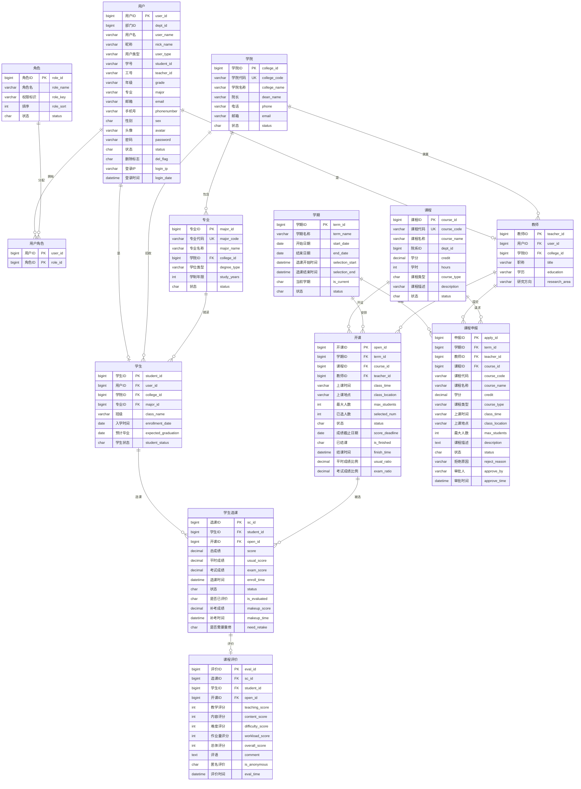

# 选课管理系统数据库设计文档

## 一、数据库表汇总

### 1. 教务管理核心表

| 表名 | 说明 | 主键 |
|------|------|------|
| edu_college | 学院表 | college_id |
| edu_major | 专业表 | major_id |
| edu_course | 课程表 | course_id |
| edu_term | 学期表 | term_id |
| edu_student | 学生表 | student_id |
| edu_teacher | 教师表 | teacher_id |
| edu_course_opening | 开课安排表 | open_id |
| edu_student_course | 选课记录表 | sc_id |
| edu_course_evaluation | 课程评价表 | eval_id |
| edu_course_apply | 开课申请表 | apply_id |

### 2. 系统管理表

| 表名 | 说明 | 主键 |
|------|------|------|
| sys_user | 系统用户表 | user_id |
| sys_role | 角色表 | role_id |
| sys_dept | 部门表 | dept_id |
| sys_user_role | 用户角色关联表 | user_id, role_id |

---

## 二、表结构详情

### 2.1 edu_college（学院表）
| 字段名 | 类型 | 说明 |
|--------|------|------|
| college_id | bigint | 学院ID（主键） |
| college_code | varchar(20) | 学院代码（唯一） |
| college_name | varchar(100) | 学院名称 |
| dean_name | varchar(50) | 院长姓名 |
| phone | varchar(20) | 联系电话 |
| email | varchar(100) | 邮箱 |
| status | char(1) | 状态（0正常 1停用） |

### 2.2 edu_major（专业表）
| 字段名 | 类型 | 说明 |
|--------|------|------|
| major_id | bigint | 专业ID（主键） |
| major_code | varchar(20) | 专业代码（唯一） |
| major_name | varchar(100) | 专业名称 |
| **college_id** | bigint | 所属学院ID（外键→edu_college） |
| degree_type | varchar(20) | 学位类型 |
| study_years | int | 学制年限 |

### 2.3 edu_course（课程表）
| 字段名 | 类型 | 说明 |
|--------|------|------|
| course_id | bigint | 课程ID（主键） |
| course_code | varchar(20) | 课程代码（唯一） |
| course_name | varchar(64) | 课程名称 |
| dept_id | bigint | 开课院系ID |
| credit | decimal(3,1) | 学分 |
| hours | int | 学时 |
| course_type | char(1) | 课程类型（1必修 2选修） |
| description | varchar(500) | 课程描述 |

### 2.4 edu_term（学期表）
| 字段名 | 类型 | 说明 |
|--------|------|------|
| term_id | bigint | 学期ID（主键） |
| term_name | varchar(64) | 学期名称 |
| start_date | date | 开学日期 |
| end_date | date | 结束日期 |
| selection_start | datetime | 选课开始时间 |
| selection_end | datetime | 选课结束时间 |
| is_current | char(1) | 是否当前学期 |

### 2.5 edu_student（学生表）
| 字段名 | 类型 | 说明 |
|--------|------|------|
| student_id | bigint | 学生ID（主键） |
| **user_id** | bigint | 用户ID（外键→sys_user，唯一） |
| **college_id** | bigint | 学院ID（外键→edu_college） |
| **major_id** | bigint | 专业ID（外键→edu_major） |
| class_name | varchar(64) | 班级 |
| enrollment_date | date | 入学日期 |
| expected_graduation | date | 预计毕业日期 |
| student_status | char(1) | 学籍状态 |

### 2.6 edu_teacher（教师表）
| 字段名 | 类型 | 说明 |
|--------|------|------|
| teacher_id | bigint | 教师ID（主键） |
| **user_id** | bigint | 用户ID（外键→sys_user，唯一） |
| **college_id** | bigint | 学院ID（外键→edu_college） |
| title | varchar(30) | 职称 |
| education | varchar(20) | 学历 |
| research_area | varchar(200) | 研究方向 |

### 2.7 edu_course_opening（开课安排表）
| 字段名 | 类型 | 说明 |
|--------|------|------|
| open_id | bigint | 开课ID（主键） |
| **term_id** | bigint | 学期ID（外键→edu_term） |
| **course_id** | bigint | 课程ID（外键→edu_course） |
| **teacher_id** | bigint | 教师ID（外键→edu_teacher） |
| class_time | varchar(100) | 上课时间 |
| class_location | varchar(100) | 上课地点 |
| max_students | int | 最大选课人数 |
| selected_num | int | 已选人数 |
| usual_ratio | decimal(3,2) | 平时成绩占比 |
| exam_ratio | decimal(3,2) | 期末成绩占比 |
| is_finished | char(1) | 是否结课 |
| status | char(1) | 状态 |

### 2.8 edu_student_course（选课记录表）
| 字段名 | 类型 | 说明 |
|--------|------|------|
| sc_id | bigint | 选课ID（主键） |
| **student_id** | bigint | 学生ID（外键→edu_student） |
| **open_id** | bigint | 开课ID（外键→edu_course_opening） |
| score | decimal(5,2) | 总成绩 |
| usual_score | decimal(5,1) | 平时成绩 |
| exam_score | decimal(5,1) | 期末成绩 |
| makeup_score | decimal(5,2) | 补考成绩 |
| need_retake | char(1) | 是否需要重修 |
| enroll_time | datetime | 选课时间 |
| is_evaluated | char(1) | 是否已评价 |
| status | char(1) | 状态（0在读 1已退） |

### 2.9 edu_course_evaluation（课程评价表）
| 字段名 | 类型 | 说明 |
|--------|------|------|
| eval_id | bigint | 评价ID（主键） |
| **sc_id** | bigint | 选课ID（外键→edu_student_course，唯一） |
| **student_id** | bigint | 学生ID（外键→edu_student） |
| **open_id** | bigint | 开课ID（外键→edu_course_opening） |
| teaching_score | int | 教学质量评分 |
| content_score | int | 内容评分 |
| difficulty_score | int | 难度评分 |
| workload_score | int | 作业量评分 |
| overall_score | int | 综合评分 |
| comment | text | 评价内容 |
| is_anonymous | char(1) | 是否匿名 |

### 2.10 edu_course_apply（开课申请表）
| 字段名 | 类型 | 说明 |
|--------|------|------|
| apply_id | bigint | 申请ID（主键） |
| **term_id** | bigint | 学期ID（外键→edu_term） |
| **teacher_id** | bigint | 教师ID（外键→edu_teacher） |
| **course_id** | bigint | 课程ID（外键→edu_course，可选） |
| course_name | varchar(100) | 课程名称 |
| credit | decimal(3,1) | 学分 |
| class_time | varchar(100) | 上课时间 |
| class_location | varchar(100) | 上课地点 |
| max_students | int | 最大人数 |
| status | char(1) | 审批状态 |
| reject_reason | varchar(500) | 驳回原因 |

### 2.11 sys_user（系统用户表）
| 字段名 | 类型 | 说明 |
|--------|------|------|
| user_id | bigint | 用户ID（主键） |
| dept_id | bigint | 部门ID |
| user_name | varchar(30) | 登录账号 |
| nick_name | varchar(30) | 用户昵称/真实姓名 |
| user_type | varchar(2) | 用户类型 |
| email | varchar(50) | 邮箱 |
| phonenumber | varchar(11) | 手机号 |
| sex | char(1) | 性别 |
| password | varchar(100) | 密码 |
| status | char(1) | 状态 |

### 2.12 sys_role（角色表）
| 字段名 | 类型 | 说明 |
|--------|------|------|
| role_id | bigint | 角色ID（主键） |
| role_name | varchar(30) | 角色名称 |
| role_key | varchar(100) | 角色标识 |
| role_sort | int | 排序 |
| status | char(1) | 状态 |

### 2.13 sys_user_role（用户角色关联表）
| 字段名 | 类型 | 说明 |
|--------|------|------|
| user_id | bigint | 用户ID（联合主键） |
| role_id | bigint | 角色ID（联合主键） |

---

## 三、ER图（Mermaid格式）



---

## 四、表关系说明

### 4.1 核心关系链

```
sys_user (用户账号)
    ├── edu_student (学生身份) ──→ edu_college (学院) ──→ edu_major (专业)
    └── edu_teacher (教师身份) ──→ edu_college (学院)

edu_course (课程库)
    └── edu_course_opening (学期开课) ←── edu_term (学期)
            │                        ←── edu_teacher (授课教师)
            │
            └── edu_student_course (选课记录) ←── edu_student (选课学生)
                    │
                    └── edu_course_evaluation (课程评价)
```

### 4.2 关系类型汇总

| 关系 | 类型 | 说明 |
|------|------|------|
| sys_user → edu_student | 1:1 | 一个用户对应一个学生身份 |
| sys_user → edu_teacher | 1:1 | 一个用户对应一个教师身份 |
| edu_college → edu_major | 1:N | 一个学院包含多个专业 |
| edu_college → edu_student | 1:N | 一个学院有多个学生 |
| edu_college → edu_teacher | 1:N | 一个学院有多个教师 |
| edu_major → edu_student | 1:N | 一个专业有多个学生 |
| edu_course → edu_course_opening | 1:N | 一门课程可开设多个班次 |
| edu_term → edu_course_opening | 1:N | 一个学期有多个开课 |
| edu_teacher → edu_course_opening | 1:N | 一个教师可教多门课 |
| edu_student → edu_student_course | 1:N | 一个学生可选多门课 |
| edu_course_opening → edu_student_course | 1:N | 一个开课可被多人选 |
| edu_student_course → edu_course_evaluation | 1:1 | 一条选课对应一个评价 |

---

## 五、数据库触发器和存储过程

### 5.1 触发器：trg_calc_score_before_update
- **作用**：当更新平时成绩或期末成绩时，自动计算总成绩
- **公式**：`score = usual_score × usual_ratio + exam_score × exam_ratio`

### 5.2 存储过程：recalc_course_scores
- **作用**：当教师修改成绩比例时，批量重新计算该课程所有学生的总成绩
- **调用**：`CALL recalc_course_scores(open_id)`
