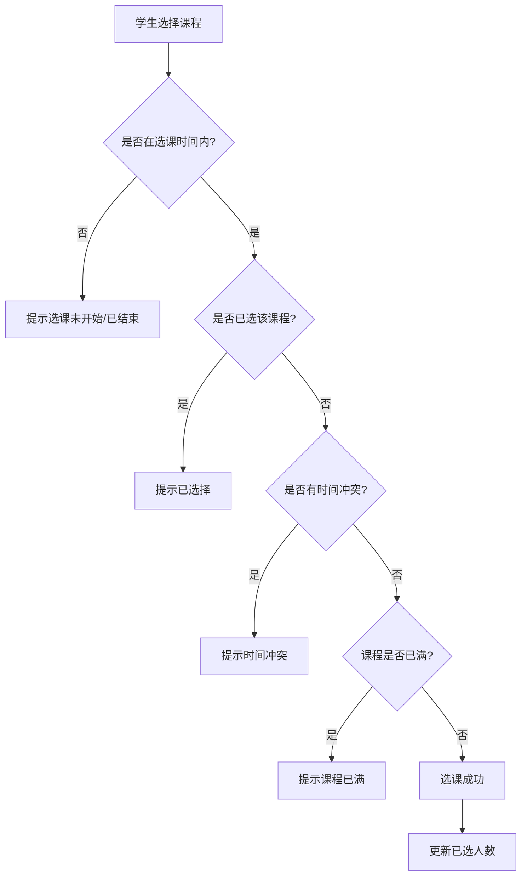
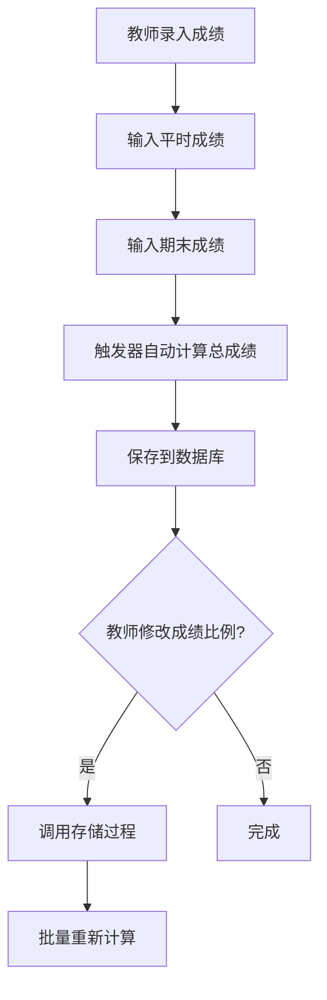

# 选课管理系统实验报告

**项目名称**：选课管理系统  
**开发框架**：RuoYi 3.9.0  
**开发时间**：2025年12月  
**作者**：[您的姓名]  
**学号**：[您的学号]  

---

## 一、前言

### 1.1 项目背景

随着高等教育规模的不断扩大和教学管理的日益复杂化，传统的人工选课方式已无法满足现代高校教学管理的需求。学生选课涉及课程信息发布、学生选课、教师排课、成绩管理、课程评价等多个环节，各环节之间存在复杂的数据关联和业务逻辑。传统管理方式存在以下问题：

1. **效率低下**：人工统计选课数据、制作课表耗时耗力，容易出错
2. **信息不透明**：学生难以及时获取课程信息和选课结果
3. **冲突频发**：时间冲突、容量超限等问题难以实时监控
4. **成绩管理困难**：成绩录入、统计、查询等工作量大，数据易丢失
5. **缺乏反馈机制**：课程质量评价难以收集和分析

因此，开发一套功能完善、操作便捷、安全可靠的选课管理系统，对于提高高校教学管理水平、优化教学资源配置、提升教学质量具有重要意义。

### 1.2 项目目标

本项目旨在设计并实现一个基于Web的选课管理系统，实现高校选课业务的全流程信息化管理。具体目标包括：

**功能目标**：
- 实现学生在线选课、退课，实时查看课表和成绩
- 支持教师课程管理、成绩录入、补考管理
- 提供管理员对学期、课程、用户的全面管理
- 建立完善的课程评价反馈机制
- 实现教师开课申报与审批流程

**技术目标**：
- 采用前后端分离架构，提升系统可维护性和扩展性
- 使用成熟的开发框架，确保系统稳定性和安全性
- 设计规范的数据库结构，保证数据一致性和完整性
- 实现响应式界面，支持多种设备访问

**业务目标**：
- 简化选课流程，提高选课效率
- 避免时间冲突和容量超限问题
- 实现成绩自动计算和多维度统计
- 建立数据驱动的课程质量评价体系

### 1.3 技术选型

本系统基于若依（RuoYi）开发框架进行开发，采用前后端分离架构，技术栈如下：

**后端技术栈**：
- **核心框架**：Spring Boot 2.5.15 — 简化Spring应用的初始搭建以及开发过程
- **持久层框架**：MyBatis 3.5.9 — 支持定制化SQL、存储过程以及高级映射
- **安全框架**：Spring Security — 提供认证、授权等安全功能
- **数据库**：MySQL 8.0 — 开源关系型数据库，支持触发器和存储过程
- **缓存**：Redis — 高性能的key-value数据库，用于缓存和会话管理
- **API文档**：Swagger — 自动生成RESTful API文档

**前端技术栈**：
- **核心框架**：Vue.js 2.6 — 渐进式JavaScript框架
- **UI组件库**：Element UI — 基于Vue的桌面端组件库
- **状态管理**：Vuex — Vue的状态管理模式
- **路由管理**：Vue Router — Vue的官方路由管理器
- **HTTP客户端**：Axios — 基于Promise的HTTP客户端
- **构建工具**：Webpack — 模块打包工具

**数据库设计特色**：
- **触发器**：`trg_calc_score_before_update` — 自动计算学生总成绩
- **存储过程**：`recalc_course_scores` — 批量重新计算课程成绩
- **唯一约束**：`uk_student_open` — 防止学生重复选课

### 1.4 系统特色

本系统在设计和实现过程中，充分考虑了实际业务需求，具有以下特色功能：

**1. 灵活的成绩管理机制**
- 支持教师自定义平时成绩和期末成绩占比
- 成绩比例变更时自动重新计算所有学生成绩
- 支持补考成绩录入和重修标记
- 提供GPA计算和多维度成绩统计

**2. 完善的选课控制**
- 选课时间段限制，确保选课秩序
- 自动检测上课时间冲突
- 实时容量控制，防止超额选课
- 同名课程互斥，避免重复选课

**3. 课程质量反馈体系**
- 多维度课程评价（教学质量、内容、难度、作业量）
- 支持匿名评价，鼓励真实反馈
- 结课后才能评价，确保评价有效性
- 评价数据统计分析

**4. 响应式用户界面**
- 采用Element UI组件库，界面美观统一
- 添加媒体查询，适配不同屏幕尺寸
- 表格自动调整列显示，优化移动端体验
- 实时数据更新，交互流畅

**5. 严格的数据一致性保障**
- 数据库触发器自动维护成绩计算
- 唯一索引防止数据重复
- 事务控制确保操作原子性
- 前后端双重数据验证

### 1.5 报告结构

本报告共分为七个部分：

- **第一部分：前言** — 介绍项目背景、目标、技术选型和系统特色
- **第二部分：需求分析** — 分析系统的功能需求和非功能需求
- **第三部分：系统设计** — 阐述系统架构、数据库设计和功能模块设计
- **第四部分：系统实现** — 详细说明核心功能的实现过程和关键代码
- **第五部分：系统测试** — 介绍测试策略、测试用例和测试结果
- **第六部分：项目总结** — 总结项目完成情况、创新点和不足之处
- **第七部分：参考文献** — 列出开发过程中参考的文献资料

---

## 二、需求分析

### 2.1 系统角色分析

本系统涉及三类用户角色，各角色的权限和功能需求如下：

#### 2.1.1 学生角色
- 在线选课、退课
- 查看个人课表
- 查询成绩和GPA
- 对已修课程进行评价
- 查看课程详细信息

#### 2.1.2 教师角色
- 申报开课
- 管理授课课程
- 录入学生成绩（平时成绩、期末成绩）
- 录入补考成绩
- 查看课程评价反馈
- 自定义成绩计算比例

#### 2.1.3 管理员角色
- 学期管理（创建、开放、关闭）
- 课程管理（添加、修改、删除）
- 用户管理（学生、教师）
- 开课管理（审批、安排）
- 成绩管理（查询、统计）
- 评价管理（查看、分析）

### 2.2 功能需求

#### 2.2.1 选课管理模块
**功能描述**：实现学生在线选课、退课功能，保证选课过程的合理性和有序性。

**核心需求**：
1. 选课前置条件检查
   - 判断是否在选课时间范围内
   - 检查课程是否已满
   - 检测上课时间冲突
   - 防止同名课程重复选择
2. 选课操作
   - 学生提交选课请求
   - 系统实时更新已选人数
   - 返回选课结果反馈
3. 退课操作
   - 学生申请退课
   - 系统减少已选人数
   - 释放课程名额

**约束条件**：
- 同一学生对同一课程只能选一次
- 选课人数不能超过课程容量
- 同一时间段不能选择多门课程

#### 2.2.2 成绩管理模块
**功能描述**：实现成绩录入、计算、查询和统计功能，支持灵活的成绩计算规则。

**核心需求**：
1. 成绩录入
   - 教师录入平时成绩
   - 教师录入期末成绩
   - 系统自动计算总成绩
2. 补考管理
   - 标记挂科学生
   - 录入补考成绩
   - 标记是否需要重修
3. 成绩查询
   - 学生查看个人成绩
   - 教师查看班级成绩
   - 管理员查看统计数据
4. 成绩计算规则
   - 教师可自定义平时/期末占比
   - 比例修改后自动重新计算
   - 总成绩 = 平时成绩 × 平时占比 + 期末成绩 × 期末占比

**数据完整性保障**：
- 使用数据库触发器自动计算总成绩
- 使用存储过程批量重新计算成绩
- 成绩比例之和必须等于100%

#### 2.2.3 课程评价模块
**功能描述**：建立课程质量反馈机制，收集学生对课程的多维度评价。

**核心需求**：
1. 评价提交
   - 学生对已修课程打分
   - 支持多维度评价（教学质量、内容、难度、作业量）
   - 可选文字评语
   - 支持匿名评价
2. 评价查看
   - 教师查看课程评价统计
   - 管理员查看评价详情
   - 评价数据可视化展示

**评价规则**：
- 只有课程结课后才能评价
- 每门课程只能评价一次
- 评价后不可修改

#### 2.2.4 课程申报模块
**功能描述**：实现教师开课申报和管理员审批流程。

**核心需求**：
1. 申报提交
   - 教师选择学期
   - 填写课程信息
   - 设置上课时间和地点
   - 设定最大选课人数
2. 审批流程
   - 管理员查看申报列表
   - 审核通过生成开课记录
   - 审核驳回需填写原因
3. 申报状态跟踪
   - 待审批
   - 已通过
   - 已驳回

### 2.3 非功能需求

#### 2.3.1 性能需求
- **响应时间**：普通查询操作响应时间 < 1秒
- **并发处理**：支持100+用户同时在线操作
- **数据准确性**：成绩计算误差 < 0.01

#### 2.3.2 安全需求
- **身份认证**：基于JWT的用户身份认证
- **权限控制**：基于角色的访问控制（RBAC）
- **数据加密**：密码采用BCrypt加密存储
- **SQL注入防护**：使用MyBatis预编译语句

#### 2.3.3 可用性需求
- **界面友好**：采用Element UI统一组件风格
- **操作简便**：关键操作不超过3次点击
- **响应式设计**：支持PC、平板、手机访问
- **错误提示**：操作失败时给出明确提示

#### 2.3.4 可维护性需求
- **代码规范**：遵循Java编码规范和Vue风格指南
- **注释完整**：关键业务逻辑添加详细注释
- **模块化设计**：前后端分离，模块职责清晰
- **文档完善**：提供数据库设计文档和API文档

---

## 三、系统设计

### 3.1 系统架构设计

#### 3.1.1 整体架构

本系统采用**前后端分离**的B/S架构，整体分为三层：

```
┌─────────────────────────────────────────────────┐
│              前端展示层（Vue.js）                  │
│  ┌──────────┐  ┌──────────┐  ┌──────────┐       │
│  │ 学生端   │  │ 教师端   │  │ 管理端   │       │
│  └──────────┘  └──────────┘  └──────────┘       │
└─────────────────────────────────────────────────┘
                      ↕ HTTP/JSON
┌─────────────────────────────────────────────────┐
│            后端业务层（Spring Boot）               │
│  ┌──────────┐  ┌──────────┐  ┌──────────┐       │
│  │ 控制层   │  │ 服务层   │  │ 数据层   │       │
│  │Controller│→ │ Service  │→ │ Mapper   │       │
│  └──────────┘  └──────────┘  └──────────┘       │
└─────────────────────────────────────────────────┘
                      ↕ JDBC
┌─────────────────────────────────────────────────┐
│              数据持久层（MySQL）                   │
│  ┌──────────┐  ┌──────────┐  ┌──────────┐       │
│  │ 数据表   │  │ 触发器   │  │ 存储过程 │       │
│  └──────────┘  └──────────┘  └──────────┘       │
└─────────────────────────────────────────────────┘
```

#### 3.1.2 技术架构

**前端架构**：
```
Vue.js + Element UI
    ├── 路由管理（Vue Router）
    ├── 状态管理（Vuex）
    ├── HTTP请求（Axios）
    └── 工具库（date-fns, echarts等）
```

**后端架构**：
```
Spring Boot
    ├── Spring Security（安全认证）
    ├── Spring MVC（Web层）
    ├── MyBatis（持久层）
    ├── Redis（缓存）
    └── Swagger（API文档）
```

### 3.2 数据库设计

#### 3.2.1 数据库概览

本系统数据库共包含**14张核心表**，分为以下几类：

| 类别 | 表数量 | 包含的表 |
|------|--------|----------|
| 教务核心表 | 10 | 学院、专业、课程、学期、学生、教师、开课、选课、评价、申报 |
| 系统管理表 | 4 | 用户、角色、部门、用户角色关联 |

详细的ER图和表结构请参考：[database_er_diagram.md](./database_er_diagram.md)

#### 3.2.2 核心表设计

**（此处可插入主要表的DDL或详细说明）**

#### 3.2.3 数据库特色设计

**1. 触发器：自动成绩计算**
```sql
CREATE TRIGGER trg_calc_score_before_update
BEFORE UPDATE ON edu_student_course
FOR EACH ROW
BEGIN
    -- 当平时或期末成绩更新时，自动计算总成绩
    IF NEW.usual_score IS NOT NULL AND NEW.exam_score IS NOT NULL THEN
        -- 获取课程的成绩比例
        SELECT usual_ratio, exam_ratio INTO @usual_r, @exam_r
        FROM edu_course_opening WHERE open_id = NEW.open_id;
        
        -- 计算总成绩
        SET NEW.score = NEW.usual_score * @usual_r + NEW.exam_score * @exam_r;
    END IF;
END;
```

**2. 存储过程：批量重新计算成绩**
```sql
CREATE PROCEDURE recalc_course_scores(IN p_open_id BIGINT)
BEGIN
    -- 当教师修改成绩比例时，重新计算该课程所有学生的成绩
    UPDATE edu_student_course sc
    JOIN edu_course_opening co ON sc.open_id = co.open_id
    SET sc.score = sc.usual_score * co.usual_ratio + sc.exam_score * co.exam_ratio
    WHERE sc.open_id = p_open_id
      AND sc.usual_score IS NOT NULL
      AND sc.exam_score IS NOT NULL;
END;
```

**3. 唯一约束：防止重复选课**
```sql
ALTER TABLE edu_student_course
ADD CONSTRAINT uk_student_open UNIQUE (student_id, open_id);
```

### 3.3 功能模块设计

#### 3.3.1 模块划分

系统共分为**6个功能模块**：

1. **用户认证模块**：登录、注销、权限验证
2. **选课管理模块**：选课、退课、课表查询
3. **成绩管理模块**：成绩录入、查询、统计
4. **课程评价模块**：评价提交、查看、统计
5. **课程申报模块**：申报提交、审批
6. **系统管理模块**：用户、课程、学期管理

#### 3.3.2 核心业务流程

**选课流程**：


**成绩录入流程**：


### 3.4 接口设计

#### 3.4.1 RESTful API规范

本系统遵循RESTful API设计规范：

| 请求方法 | 用途 | 示例 |
|---------|------|------|
| GET | 查询资源 | `GET /api/courses` |
| POST | 创建资源 | `POST /api/courses` |
| PUT | 更新资源 | `PUT /api/courses/{id}` |
| DELETE | 删除资源 | `DELETE /api/courses/{id}` |

#### 3.4.2 核心接口列表

**（此处列出主要API接口及参数）**

---

## 四、系统实现

### 4.1 开发环境

| 工具/环境 | 版本 |
|----------|------|
| 操作系统 | Ubuntu 22.04 / Windows 11 |
| JDK | 1.8+ |
| Node.js | 14.x+ |
| MySQL | 8.0 |
| Redis | 6.0+ |
| IDE | IntelliJ IDEA / VS Code |

### 4.2 核心功能实现

#### 4.2.1 选课功能实现

**后端实现**：

文件位置：`ruoyi-admin/src/main/java/com/ruoyi/education/service/impl/EduStudentCourseServiceImpl.java`

```java
@Override
@Transactional
public AjaxResult enrollCourse(Long studentId, Long openId) {
    // 1. 检查课程是否存在
    EduCourseOpening opening = eduCourseOpeningMapper.selectEduCourseOpeningByOpenId(openId);
    if (opening == null) {
        return AjaxResult.error("课程不存在");
    }
    
    // 2. 检查选课时间
    EduTerm term = eduTermMapper.selectEduTermByTermId(opening.getTermId());
    Date now = new Date();
    if (term.getSelectionStart() != null && now.before(term.getSelectionStart())) {
        return AjaxResult.error("选课尚未开始");
    }
    if (term.getSelectionEnd() != null && now.after(term.getSelectionEnd())) {
        return AjaxResult.error("选课已结束");
    }
    
    // 3. 检查是否已选
    EduStudentCourse existing = eduStudentCourseMapper.checkSelected(studentId, openId);
    if (existing != null) {
        if ("0".equals(existing.getStatus())) {
            return AjaxResult.error("您已选择该课程，请勿重复选择");
        } else if ("1".equals(existing.getStatus())) {
            return AjaxResult.error("该课程已结课，无法重复选择");
        }
    }
    
    // 4. 检查课程容量
    if (opening.getSelectedNum() >= opening.getMaxStudents()) {
        return AjaxResult.error("该课程已满，无法选择");
    }
    
    // 5. 检查时间冲突
    String conflictResult = checkTimeConflict(studentId, opening.getTermId(), 
                                              opening.getClassTime(), null);
    if (conflictResult != null) {
        return AjaxResult.error(conflictResult);
    }
    
    // 6. 创建选课记录
    try {
        EduStudentCourse studentCourse = new EduStudentCourse();
        studentCourse.setStudentId(studentId);
        studentCourse.setOpenId(openId);
        studentCourse.setEnrollTime(new Date());
        studentCourse.setStatus("0");
        eduStudentCourseMapper.insertEduStudentCourse(studentCourse);
        
        // 7. 更新已选人数
        eduCourseOpeningMapper.incrementSelectedNum(openId);
        
        return AjaxResult.success("选课成功");
    } catch (Exception e) {
        logger.error("选课异常", e);
        return AjaxResult.error("选课失败，请稍后重试");
    }
}
```

**前端实现**：

文件位置：`ruoyi-ui/src/views/education/selection/enroll.vue`

```javascript
// 选课操作
handleEnroll(row) {
  this.$confirm('确认选择该课程吗?', '提示', {
    confirmButtonText: '确定',
    cancelButtonText: '取消',
    type: 'warning'
  }).then(() => {
    enrollCourse(row.openId).then(response => {
      this.$modal.msgSuccess("选课成功");
      this.getList(); // 刷新课程列表
      this.getMyCourses(); // 刷新我的课程
    }).catch(error => {
      this.$modal.msgError(error.msg || "选课失败");
    });
  });
}
```

#### 4.2.2 成绩管理实现

**（此处详细说明成绩录入、计算、统计的实现）**

#### 4.2.3 课程评价实现

**（此处详细说明评价提交、查看的实现）**

### 4.3 关键技术实现

#### 4.3.1 时间冲突检测

**（详细说明时间冲突检测算法）**

#### 4.3.2 响应式设计实现

**（说明如何使用媒体查询实现响应式）**

#### 4.3.3 数据一致性保障

**（说明触发器和存储过程的使用）**

---

## 五、系统测试

### 5.1 测试环境

| 项目 | 配置 |
|------|------|
| 服务器 | Ubuntu 22.04 |
| 浏览器 | Chrome 120, Firefox 121, Edge 120 |
| 数据库 | MySQL 8.0 |

### 5.2 测试策略

**（说明测试方法和策略）**

### 5.3 功能测试

#### 5.3.1 选课功能测试

| 测试项 | 测试步骤 | 预期结果 | 实际结果 |
|--------|---------|---------|---------|
| 正常选课 | 1. 登录学生账号<br>2. 选择课程<br>3. 点击选课 | 选课成功，课表更新 | 通过 ✓ |
| 时间冲突 | 1. 已选周一1-2节课程<br>2. 再选周一1-2节其他课程 | 提示时间冲突 | 通过 ✓ |
| 容量限制 | 1. 课程已满<br>2. 尝试选课 | 提示课程已满 | 通过 ✓ |
| 重复选课 | 1. 已选某课程<br>2. 再次选择 | 提示已选择 | 通过 ✓ |

#### 5.3.2 成绩管理测试

**（详细测试用例）**

### 5.4 性能测试

**（说明并发测试、压力测试结果）**

### 5.5 安全测试

**（说明SQL注入、XSS等安全测试）**

---

## 六、项目总结

### 6.1 完成情况

本项目历时XX周，完成了选课管理系统的设计、开发和测试工作。主要完成内容包括：

**功能完成度**：
- ✅ 学生选课、退课、课表查询
- ✅ 教师成绩录入、课程管理
- ✅ 管理员系统管理功能
- ✅ 课程评价反馈系统
- ✅ 开课申报审批流程
- ✅ 响应式界面设计

**技术实现**：
- ✅ 前后端分离架构
- ✅ 数据库触发器和存储过程
- ✅ 时间冲突检测算法
- ✅ 数据一致性保障
- ✅ 权限控制和安全防护

### 6.2 创新点

1. **灵活的成绩计算机制**
   - 教师可自定义成绩比例
   - 比例变更自动重新计算
   - 触发器保证数据一致性

2. **完善的冲突检测**
   - 时间冲突自动检测
   - 同名课程互斥
   - 容量实时控制

3. **响应式界面设计**
   - 适配多种设备
   - 表格智能隐藏列
   - 优化移动端体验

### 6.3 遇到的问题及解决方案

**问题1：成绩比例修改后数据不一致**
- **问题描述**：教师修改成绩比例后，已录入的成绩未重新计算
- **解决方案**：创建存储过程批量重新计算，在后端调用

**问题2：选课重复问题**
- **问题描述**：并发选课时可能出现重复记录
- **解决方案**：添加唯一约束 + 前后端双重检测 + 异常捕获

**问题3：前端数据格式不一致**
- **问题描述**：部分页面term选项返回格式不统一
- **解决方案**：统一后端返回AjaxResult格式，前端使用response.data

### 6.4 不足与改进方向

**当前不足**：
1. 缺少选课轮次管理（如第一轮、第二轮）
2. 没有实现选课志愿功能
3. 评价数据分析不够深入
4. 移动端App未开发

**改进方向**：
1. 增加选课轮次和抽签功能
2. 引入课程推荐算法
3. 完善数据可视化分析
4. 开发移动端原生应用
5. 引入消息推送功能

### 6.5 心得体会

通过本项目的开发，我深刻体会到：

1. **需求分析的重要性**：充分理解业务需求是开发的基础
2. **框架选型的价值**：选择成熟框架大幅提高开发效率
3. **数据库设计的关键**：良好的数据库设计是系统稳定的保障
4. **团队协作的必要**：前后端分离需要良好的接口约定
5. **测试驱动的意义**：完善的测试是系统质量的保证

---

## 七、参考文献

[1] Spring Boot官方文档. https://spring.io/projects/spring-boot  
[2] Vue.js官方文档. https://cn.vuejs.org/  
[3] Element UI组件库. https://element.eleme.cn/  
[4] MyBatis官方文档. https://mybatis.org/mybatis-3/zh/index.html  
[5] MySQL官方文档. https://dev.mysql.com/doc/  
[6] 若依框架文档. http://doc.ruoyi.vip/  
[7] RESTful API设计指南. https://restfulapi.net/  
[8] 《Spring Boot实战》. 汪云飞. 电子工业出版社. 2016  
[9] 《Vue.js权威指南》. 张耀春. 电子工业出版社. 2017  
[10] 《数据库系统概论》（第5版）. 王珊. 高等教育出版社. 2014

---

## 附录

### 附录A：数据库表结构

详见 [database_er_diagram.md](./database_er_diagram.md)

### 附录B：API接口文档

系统运行后访问：http://localhost:8080/swagger-ui.html

### 附录C：系统截图

**（此处可插入系统主要功能的截图）**

### 附录D：源代码说明

项目源代码结构：
```
CourseSelection/
├── ruoyi-admin/        # 后端主模块
├── ruoyi-common/       # 公共模块
├── ruoyi-framework/    # 框架模块
├── ruoyi-system/       # 系统模块
├── ruoyi-ui/          # 前端模块
├── sql/               # 数据库脚本
└── doc/               # 文档
```
